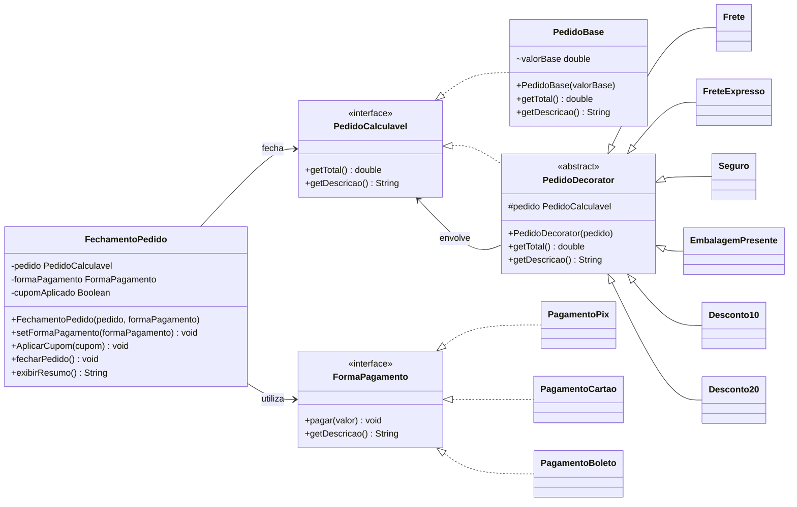

# Módulo de Fechamento de Pedidos

Aplicação Java desenvolvida para demonstrar o uso de orientação a objetos e dos padrões de projeto **Strategy** e **Decorator** em um módulo de fechamento de pedidos.

O sistema permite criar um pedido com valor base, acrescentar serviços e taxas de forma dinâmica, aplicar um cupom de desconto e selecionar a forma de pagamento utilizada no fechamento.

## Funcionalidades

- Criação de pedidos com valor base.
- Adição de frete padrão.
- Adição opcional de taxa de entrega expressa.
- Adição de seguro.
- Adição de embalagem de presente.
- Aplicação de cupom de 10% ou 20% de desconto.
- Validação para impedir a aplicação de mais de um cupom no mesmo fechamento.
- Pagamento por PIX, cartão ou boleto.
- Exibição da descrição completa e do valor final do pedido.

## Padrões de projeto

### Strategy

O padrão **Strategy** é utilizado para representar as diferentes formas de pagamento.

A interface `FormaPagamento` define as operações comuns às estratégias:

```java
void pagar(double valor);
String getDescricao();
```

As implementações disponíveis são:

- `PagamentoPix`
- `PagamentoCartao`
- `PagamentoBoleto`

A classe `FechamentoPedido` trabalha com a abstração `FormaPagamento`. Dessa maneira, a forma de pagamento pode ser escolhida no construtor ou alterada por meio de `setFormaPagamento`, sem modificar a lógica de fechamento do pedido.

Exemplo:

```java
PedidoCalculavel pedido = new PedidoBase(200);

FechamentoPedido fechamento =
        new FechamentoPedido(pedido, new PagamentoPix());

fechamento.fecharPedido();
```

### Decorator

O padrão **Decorator** é utilizado para acrescentar taxas, serviços e descontos ao pedido sem alterar a classe `PedidoBase`.

`PedidoCalculavel` define o contrato comum. `PedidoBase` representa o componente original e `PedidoDecorator` é a classe abstrata que mantém uma referência para outro `PedidoCalculavel`.

Os decorators concretos são:

| Decorator | Efeito no total |
| --- | ---: |
| `Frete` | adiciona R$ 10,00 |
| `FreteExpresso` | adiciona R$ 10,00 como taxa do serviço expresso |
| `Seguro` | adiciona R$ 20,00 |
| `EmbalagemPresente` | adiciona R$ 5,00 |
| `Desconto10` | aplica 10% de desconto |
| `Desconto20` | aplica 20% de desconto |

Os decorators podem ser encadeados. Cada objeto chama o objeto interno e acrescenta sua própria responsabilidade:

```java
PedidoCalculavel pedido = new PedidoBase(650);

pedido = new Frete(pedido);
pedido = new FreteExpresso(pedido);
pedido = new Seguro(pedido);
pedido = new EmbalagemPresente(pedido);
```

A cadeia resultante é:

```text
EmbalagemPresente
    -> Seguro
        -> FreteExpresso
            -> Frete
                -> PedidoBase
```

O objeto mais externo fornece a descrição e o total acumulados de toda a cadeia.

## Conceitos de orientação a objetos

- **Abstração:** uso das interfaces `PedidoCalculavel` e `FormaPagamento`.
- **Encapsulamento:** `FechamentoPedido` mantém internamente o pedido, a estratégia de pagamento e o controle de cupom.
- **Herança:** os decorators concretos herdam de `PedidoDecorator`.
- **Polimorfismo:** pedidos e formas de pagamento são manipulados por meio de seus contratos, permitindo trocar implementações sem alterar o código cliente.
- **Composição e delegação:** cada decorator armazena outro `PedidoCalculavel` e delega a ele o cálculo anterior antes de modificar o resultado.

## Diagrama de classes



## Estrutura do projeto

```text
src/
|-- Decorator/
|   |-- Desconto10.java
|   |-- Desconto20.java
|   |-- EmbalagemPresente.java
|   |-- Frete.java
|   |-- FreteExpresso.java
|   `-- Seguro.java
|-- Main/
|   `-- Main.java
|-- Pedidos/
|   |-- FechamentoPedido.java
|   |-- PedidoBase.java
|   |-- PedidoCalculavel.java
|   `-- PedidoDecorator.java
`-- Strategy/
    |-- FormaPagamento.java
    |-- PagamentoBoleto.java
    |-- PagamentoCartao.java
    `-- PagamentoPix.java
```

## Como executar

### Requisitos

- JDK 8 ou superior.
- Uma IDE Java, como IntelliJ IDEA, ou um terminal com `javac` e `java` configurados.

### Pela IntelliJ IDEA

1. Clone ou baixe o repositório.
2. Abra a pasta do projeto na IntelliJ IDEA.
3. Aguarde o reconhecimento do JDK e da pasta `src`.
4. Abra `src/Main/Main.java`.
5. Execute o método `main`.

### Pelo terminal no Windows

Na pasta raiz do projeto, execute:

```powershell
javac -encoding UTF-8 -d out src\Pedidos\*.java src\Decorator\*.java src\Strategy\*.java src\Main\Main.java
java -cp out Main.Main
```

### Pelo terminal no Linux ou macOS

Na pasta raiz do projeto, execute:

```bash
javac -encoding UTF-8 -d out $(find src -name "*.java")
java -cp out Main.Main
```

## Fluxo da aplicação

1. Um `PedidoBase` é criado com o valor inicial.
2. Os decorators desejados são aplicados em sequência.
3. O pedido decorado e uma estratégia de pagamento são entregues ao `FechamentoPedido`.
4. Um cupom válido pode ser aplicado ao pedido.
5. `exibirResumo()` apresenta a composição e o total final.
6. `fecharPedido()` delega o pagamento para a estratégia selecionada.

## Exemplo de resultado

Para um pedido de R$ 650,00 com frete, taxa de entrega expressa, seguro, embalagem de presente e desconto de 20%, o cálculo é:

```text
R$ 650,00
+ R$ 10,00 de frete
+ R$ 10,00 de entrega expressa
+ R$ 20,00 de seguro
+ R$ 5,00 de embalagem de presente
= R$ 695,00
- 20% de desconto
= R$ 556,00
```

O fechamento utiliza a estratégia de pagamento escolhida para processar o valor final de R$ 556,00.
